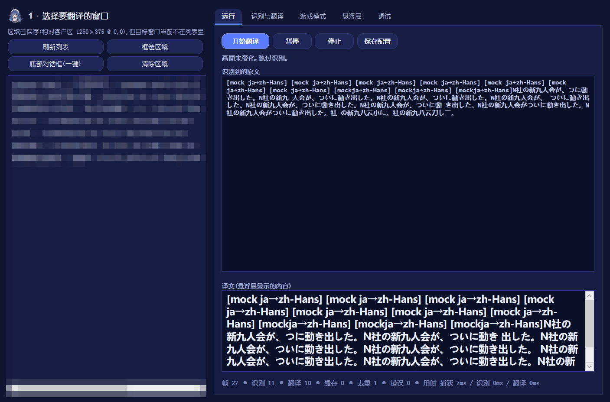
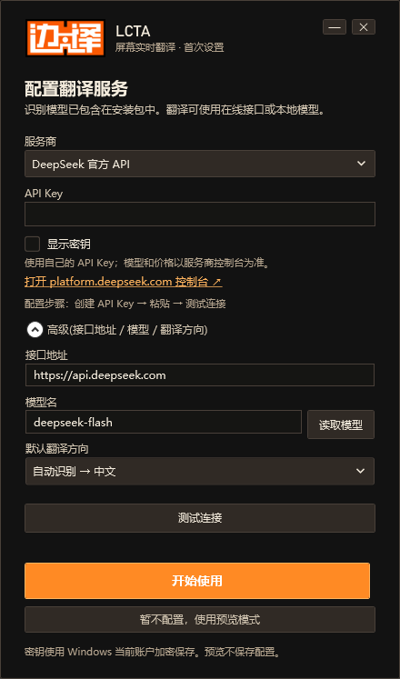
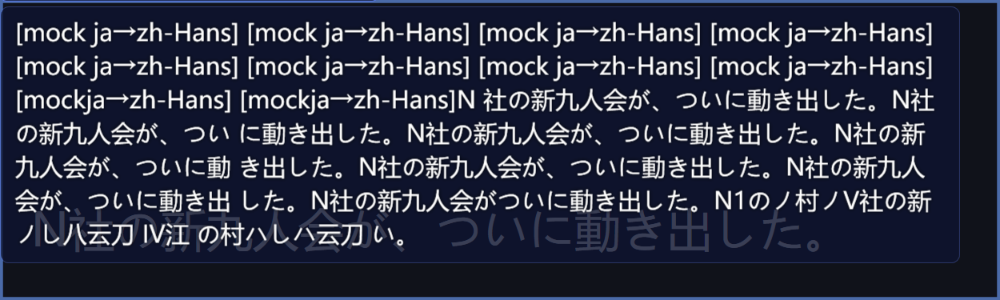

# GuGuGaGaTranslator · 屏幕实时翻译

给视觉小说(galgame)和任何带文字的游戏窗口做**实时翻译**的 Windows 小工具。

像 OBS 那样选中游戏窗口 → 框住对话框 → 之后它会一直盯着那块区域:画面一变就识别文字、翻译、把译文贴在**置顶、鼠标穿透**的悬浮层上。翻译框可以盖住原文,也可以做成字幕条。



---

## 目录

- [它能做什么](#它能做什么)
- [下载与安装](#下载与安装)
- [五分钟上手](#五分钟上手)
- [识别:两个引擎怎么选](#识别两个引擎怎么选)
- [翻译:引擎与 API Key](#翻译引擎与-api-key)
- [游戏专属模式:让译名符合剧情](#游戏专属模式让译名符合剧情)
- [悬浮层:位置、大小、透明度](#悬浮层位置大小透明度)
- [快捷键](#快捷键)
- [常见问题](#常见问题)
- [配置文件](#配置文件)
- [从源码构建](#从源码构建)
- [项目结构](#项目结构)
- [更新日志](CHANGELOG.md)
- [许可与第三方声明](#许可与第三方声明)

---

## 它能做什么

| 能力 | 说明 |
|---|---|
| **窗口级抓屏** | 选窗口而不是选屏幕坐标;窗口移动、缩放、重启后区域依然对准 |
| **离线识别** | 自带 PP-OCRv6 多语言模型,日/英/中通吃,**不需要装任何系统语言包** |
| **AI 翻译** | 接入任意 OpenAI 兼容接口(DeepSeek、智谱 GLM、硅基流动…)或本地模型 |
| **不逐字硬译** | 每句翻译都带上前几句的原文与译文,代词、语气、称呼前后一致 |
| **游戏专属术语表** | 指定作品后按它的官方译名翻译,译错了还会被自动改回 |
| **悬浮层** | 可拖动、可缩放、可调透明度,鼠标穿透到游戏;带一条游戏内控制条 |
| **只翻译新台词** | 画面没变就不重复识别、不重复花钱;重复台词走缓存 |

---

## 下载与安装

到 [Releases](../../releases) 页面,两种任选(**当前版本 1.1.0**,改动见 [更新日志](CHANGELOG.md)):

| 下载项 | 大小 | 适合 |
|---|---|---|
| **`GuGuGaGaTranslator-Setup-1.1.0.exe`** | 约 168 MB | **推荐**。双击 → 选目录 → 安装,自动建开始菜单快捷方式,可在「设置 → 应用」里卸载 |
| `GuGuGaGaTranslator-win-x64-1.1.0.zip` | 约 100 MB | 免安装版。解压到任意位置,双击里面的 `GuGuGaGaTranslator.exe` 即可(**不要把 exe 单独拖出来**,它旁边的 `models` 文件夹是识别模型) |

安装程序**不需要管理员权限**(装到当前用户目录),也不会改系统设置;它只做三件事:复制文件、建快捷方式、在「应用和功能」里登记一条卸载信息。

> **Windows 可能提示「已保护你的电脑」**:这是未签名程序的正常提示,点「更多信息」→「仍要运行」。
> 如果是从压缩包解出来的,先右键 zip → 属性 → 勾选「解除锁定」再解压,能少一堆麻烦。

### 需要额外下载什么?

| 项目 | 要不要额外下载 |
|---|---|
| 运行程序 | **不要** —— 单个 exe 自带 .NET 运行时 |
| **识别(认字)** | **不要** —— 识别模型随包附带,解压即用 |
| **翻译** | **要一个 API Key,不用装软件** —— 见 [翻译:引擎与 API Key](#翻译引擎与-api-key) |
| 完全离线翻译(可选) | 要下几 GB 模型文件 —— 见下面「本地模型」 |

---

## 五分钟上手

1. **双击启动。** 第一次运行会弹出设置卡片:识别已经能用了,翻译需要一个 API Key。卡片上有领取链接和步骤,填好后可以点「测试连接」当场验证。
   - 没有 Key 也可以先点「先跳过」:抓屏和识别照常工作,只是译文会显示成 `[mock …]` 原文 —— 用来确认框选和认字对不对。
2. **选窗口。** 主界面左列是所有可见窗口,点中你的游戏(没有就点「刷新列表」)。
   
3. **框住对话框。** 点「底部对话框(一键)」自动框住窗口底部那一条(galgame 的标准布局,会避开最底下的按钮行);想更精准就点「框选区域」自己拖,**Enter 确认 / Esc 取消**。
   - 一进框选,翻译器会**把自己收起来**(控制窗口、翻译框、语言条),框到的就是你看到的那块屏幕 —— 和微信截图一样。框完自动恢复,不抢游戏焦点。不想要这个行为,就在框选框里取消勾选「隐藏翻译界面」。
4. **开始翻译。** 点「开始翻译」,悬浮层出现在对话框上,控制条出现在悬浮层上方:
   ```
   [ 日 → 中 ] [ 其他 ▾ ] [ 🎮 游戏名 ] │ [ 🔒 编辑 ] [ 原文 ] [ 翻译框 ]
   ```
5. **调外观。** 用控制条上的「🔒 编辑」解锁,翻译框就能**像 Word 文本框一样拖动、拖四角缩放**;调好再点一下锁回,鼠标点击就还给游戏。



---

## 识别:两个引擎怎么选

「识别与翻译」页的「识别引擎」里二选一:

| 引擎 | 速度 | 前提 | 适合 |
|---|---|---|---|
| **RapidOCR 离线**(默认) | 250–600 ms/帧 | 无 —— 模型随包附带 | 默认就用它,零配置 |
| Windows OCR | 60–150 ms/帧 | 每种语言都要装系统「光学字符识别」功能 | 已装好语言包、想要更快 |

- **识别语言**(「识别与翻译」页)只对 Windows OCR 生效,必须和画面上的文字语言一致,选错会读成乱码。RapidOCR 自带多语言,不需要设这一项。
- 换 Windows OCR 需要先装语言功能,页面上的「**打开 Windows 语言设置**」按钮可以直接跳过去。
- **识别前放大倍数**:小字建议 2–3,字很大设 1 更快。
- **对比度增强**:文字和背景颜色太接近时调 0.2–0.4,正常画面保持 0。

---

## 翻译:引擎与 API Key

「翻译引擎」下拉里能选:

| 引擎 | 速度 | 花钱 | 懂不懂剧情 |
|---|---|---|---|
| **openai-compatible**(AI 模型) | 0.6–1.2 秒/句 | DeepSeek 一句约 $0.00003 | **懂** —— 能收到术语表、世界观、上下文 |
| 彩云小译 / 有道 / 百度(传统接口) | 0.2–0.8 秒/句 | 有免费额度 | 不懂 —— 协议里没有提示词这一层,术语表发不过去 |

**传统接口默认不出现在界面上**,要用得手改配置文件(见 [配置文件](#配置文件))。摆在下拉里等于给你一个看起来更便宜、实际上把「译名对得上剧情」这个能力关掉的按钮。

### 领取 API Key(界面里都有可点链接)

| 服务 | 地址 | 花费 |
|---|---|---|
| **DeepSeek**(推荐) | <https://platform.deepseek.com/> | 按量付费,一句台词约 $0.00003,新账号通常有赠送额度 |
| 智谱 GLM | <https://open.bigmodel.cn/> | `glm-4-flash` 目前免费 |
| 硅基流动 | <https://cloud.siliconflow.cn/> | 部分小模型有免费额度 |
| 本地模型 | <https://ollama.com/download> | 完全离线免费,但要先下几 GB 模型文件 |

拿到 Key 后:主界面「识别与翻译」→「✨ API 设置…」→ 选服务商 → 粘贴 Key →「测试连接」→「开始使用」。
Key 只保存在你自己的电脑上(`%APPDATA%\GuGuGaGaTranslator\config.json`,明文 JSON,**不要把这个文件发人**)。

引擎的通用配置项:

- **接口地址**:OpenAI 兼容地址,本地 Ollama 填 `http://localhost:11434/v1`,DeepSeek 填 `https://api.deepseek.com`
- **模型名**:如 `deepseek-chat`、`glm-4-flash`、`qwen2.5:7b-instruct`
- **上下文句数**(默认 3):每句翻译附带前几句,代词和语气才不会飘;调到 0 就逐句独立翻译

---

## 游戏专属模式:让译名符合剧情

通用翻译会把专有名词译成**说得通但不正确**的样子 —— 例如《边狱巴士》的「新九人会」被译成「新九人联盟」。解决办法不是调参数,是**告诉它这是哪部作品、这部作品的官方译名是什么**。

「游戏模式」页新建一份档案,里面有四样东西:

| 内容 | 作用 |
|---|---|
| 名称 + 窗口标题关键字 | 选中它 / 按标题自动切换 |
| **术语表** | `原文 = 译名 \| 禁止: 误译1、误译2`,随每句发送,并在译文里强制校正 |
| **世界观**(一两句) | 让模型认出作品,自动沿用官方译名里你没列出来的词 |
| 语气 / 风格 | 「罪人之间以名字互称,旁白冷硬」这类要求 |

**两道机制**:提示词里点名(把禁止译法写成负面例子)+ **译完硬校正**(译文落地前把「禁止译法」改回既定译名,把没翻译的术语补译)。所以术语表是**保证**,不是建议。

**不用自己写**:点「✨ 生成 / 补全术语表」,把游戏简介粘进「作品简介 / 参考资料」(百科、商店页都行,只用于这一次生成,不随台词发送),AI 会返回术语表和一句世界观建议。生成完**自己扫一眼再保存** —— AI 偶尔会把几年前的旧译名当成官方译名。

术语表写法:

```text
# 井号开头是注释
新九人会 = 新九人会 | 禁止: 新九人联盟、新九人协会
N社 = N公司 | 禁止: N 社、恩社
神室町 = 神室町
```

- 分隔符宽容:`=`、`＝`、`->`、`→`、Tab 都认;
- **等号两边写一样**表示「必须原样保留,不许意译」;
- 禁止译法用 `、` `,` `;` `/` 分隔(空格不算分隔符);
- 同一个名字的不同语言写法各列一行(日文汉字 / 韩文 / 英文),你玩哪个版本都能命中。

---

## 悬浮层:位置、大小、透明度

「悬浮层」页:

| 设置 | 说明 |
|---|---|
| **翻译框位置** | `遮盖原文`(推荐,译文盖住对话框)/ `下方` / `上方` |
| **外观预设** | 一键套用整套外观:遮盖原文 / 下方字幕 / 极简描边 / 原文+译文对照 |
| **字号、背景不透明度、圆角、内边距、字体、对齐** | 逐项微调 |
| **宽 / 高** | 像素;0 = 宽跟随所选区域、高随文字 |
| **水平 / 垂直偏移** | 在位置基础上再挪一点 |
| **鼠标穿透** | 勾上后点击直接落到游戏上;要用鼠标拖动翻译框时取消勾选(或按 `Ctrl+Alt+U`) |
| **翻译框不被录屏/截图拍到** | 默认勾选。想**录下带翻译的画面**给朋友看时取消勾选,否则录屏里只有原文、没有译文 |

拖动和缩放也可以直接用鼠标:解锁后在框内拖动移动、拖**四角的小方块**改变大小,松手自动存进配置。

---

## 快捷键

| 热键 | 作用 |
|---|---|
| `Ctrl+Alt+T` | 开始 / 停止翻译 |
| **`Ctrl+Alt+S`** | **一键框选并翻译**:直接进框选,Enter 确认后立刻开始(没选过窗口时自动认下当前前台窗口) |
| `Ctrl+Alt+R` | 重新框选区域(框完自动继续翻译) |
| `Ctrl+Alt+P` | 暂停 / 继续识别 |
| `Ctrl+Alt+U` | 解锁 / 锁定翻译框(解锁后可拖动缩放) |
| `Ctrl+Alt+O` | 显示 / 隐藏原文 |
| `Ctrl+Alt+H` | 显示 / 隐藏翻译框 |

**全都能改**:「热键」页里点进对应的方框,**直接按下你想用的组合键**就录好了(至少带一个 Ctrl / Alt / Shift / Win)。
`Backspace` 清除 = 停用这一项,`Esc` 放弃本次录入,「恢复默认快捷键」一键回到上表。被别的程序占用或写错时,页面底部会说明是哪一项没注册上。

---

## 常见问题

**Q:一定要联网吗?**
识别不需要;翻译需要(除非你本地跑模型)。没网也能用识别功能确认框选对不对。

**Q:一定要花钱吗?**
DeepSeek 一句台词约 $0.00003,新账号通常有赠送额度,够跑完一整部 galgame;想零成本可以用智谱的免费模型,或者本地跑 Ollama。

**Q:游戏全屏能用吗?**
必须用「无边框窗口 / 窗口化全屏」。**独占全屏抓不到画面,任何置顶窗口也显示不出来** —— 这是抓屏类工具的共同限制,不是本程序的 bug。

**Q:识别到的字是乱码 / 识别不到?**
1) 区域没框对(先看「运行」页显示的识别到的原文);2) 用 Windows OCR 时识别语言和游戏文字语言不一致;3) 画面太暗或文字太小,试试调大「识别前放大倍数」或「对比度增强」。

**Q:译文里混进了翻译器自己的界面文字(「刷新列表」「编辑」这类)?**
1.0.1 及以前确实会这样:识别区域按屏幕坐标抓,压在区域上的自家窗口会被当成画面文字读回来。1.1.0 起,每一帧在识别前都会把翻译器自己的窗口所覆盖的区域涂掉,不再会读到;录屏/截图功能不受影响。

**Q:对话框下面的 SAVE / LOAD 被翻译了?**
已经防住了。识别结果必须含有源语系的字符才当台词处理,纯拉丁字母的 `SAVE`、`LOAD` 会被跳过;「底部对话框(一键)」也会避开最底下那排按钮。

**Q:翻译框挡住鼠标了?**
它是鼠标穿透的(锁定时)。点它上面的控制条不会抢游戏焦点。需要编辑时按 `Ctrl+Alt+U`。

**Q:杀毒软件报毒?**
未签名的自解压 exe 常被启发式误报。源码全在这里,可以自己编译(`.\build.ps1 -Publish -SingleFile`)。

**Q:怎么卸载?**
安装版:设置 → 应用 → GuGuGaGaTranslator → 卸载。免安装版:直接删文件夹(配置在 `%APPDATA%\GuGuGaGaTranslator`,想彻底清干净就一并删掉)。

**Q:我的 API Key 存在哪?会不会被上传?**
存在 `%APPDATA%\GuGuGaGaTranslator\config.json`,只有本程序读取;请求直接发给你配置的那家服务商,不经过任何中转。

---

## 配置文件

`%APPDATA%\GuGuGaGaTranslator\config.json`(界面里改了也会写回这里,手改后重启生效)。常改的字段:

| 字段 | 作用 | 常用值 |
|---|---|---|
| `target.titleHint` | 靠标题子串找窗口 | 游戏窗口标题的一部分 |
| `target.region` | 翻译区域,**相对客户区**的偏移 | `{x,y,width,height}` |
| `target.captureBackend` | 抓屏方式 | `screen`(默认)/ `printwindow`(被遮挡时试) |
| `ocr.engine` | 识别后端 | `rapidocr` / `windows` |
| `ocr.rapidLimitSideLen` | 识别短边目标,越小越快 | `320`(大字)/ `736`(小字) |
| `translation.translator.provider` | 翻译引擎 | `openai-compatible` / `caiyun` / `youdao` / `baidu` |
| `translation.activeProfile` | 当前游戏档案 id | 空 = 通用翻译 |
| `translation.gameProfiles` | 游戏档案与术语表 | 见上文 |
| `overlay.excludeFromCapture` | 悬浮层是否对录屏/截图隐身 | `true`(默认);想录制带译文的画面设 `false` |
| `pipeline.scriptGuard` | 是否跳过不像台词的识别结果 | `true`(默认) |
| `debug.dumpFrames` | 把每帧识别结果落盘(排查用) | `false` |

---

## 从源码构建

需要 **.NET 10 SDK**:

```powershell
.\build.ps1                                   # 构建
.\build.ps1 -Configuration Release -Publish -SingleFile         # 出单文件 exe → dist\
.\build.ps1 -Configuration Release -Publish -SingleFile -Zip    # 再打一个免安装压缩包
```

命令行工具 `tools/Probe` 可以在没有界面的情况下验证整条链路:

```powershell
$probe = '.\tools\Probe\bin\Release\net10.0-windows10.0.19041.0\gugugaga-probe.exe'
& $probe windows                       # 列出可选窗口
& $probe run --title "游戏窗口标题"     # 抓屏 → 识别 → 翻译,打印结果
& $probe watch --title "游戏窗口标题"   # 跑真实管线,逐帧打印决策
& $probe terms --game limbus-company --sample "N公司的新九人联盟成立了。"   # 验证术语校正
```

`tools/Icon` 画应用图标,`tools/Installer` 是安装程序(把 `build.ps1 -Zip` 产出的包放进 `tools/Installer/payload/` 后 `dotnet publish` 即可)。

---

## 项目结构

```
src/GuGuGaGaTranslator.Core/       引擎:抓屏、识别、翻译、管线、配置(无 UI 依赖)
src/GuGuGaGaTranslator.Ocr.Rapid/  离线识别(RapidOCR + PP-OCRv6)
src/GuGuGaGaTranslator.App/        WPF 界面:主窗口、悬浮层、控制条、设置卡片
tools/Probe/                       命令行验证工具
tools/SampleWindow/                测试用的假游戏窗口
tools/Icon/                        画图标的小工具(矢量绘制,可换)
tools/Installer/                   安装程序(内置程序文件,离线可装)
models/v6/                         离线识别模型(随发布包附带)
```

---

## 许可与第三方声明

- **代码**:见仓库根目录的 `LICENSE`。
- **应用图标**:社区二创的鲸鱼娘,许可为 **CC BY-NC-SA 4.0**(署名 · 非商用 · 相同方式共享),来源与三段署名见 [THIRD_PARTY_NOTICES.md](THIRD_PARTY_NOTICES.md)。**这个图标不是开源许可**;想商用或想换成自己的图,见该文件里的说明(那里也附了一只本仓库自绘、可商用的替代图标)。
- **DeepSeek 名称与商标**归其权利人所有;本程序与 DeepSeek 官方无关,也未获其背书。
- **离线识别模型**来自 [RapidAI/RapidOCR](https://github.com/RapidAI/RapidOCR)(Apache-2.0)。
