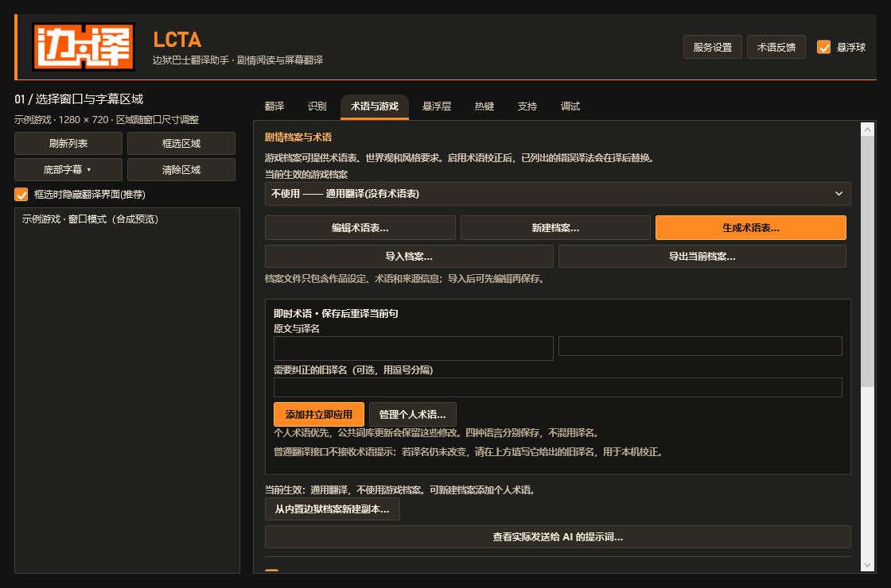

# LCTA · 边狱巴士翻译助手

LCTA（Limbus Company Translation Assistant）由 GuGuGaGaTranslator 延续开发。它在 Windows 上识别游戏或网页中的文字，把译文显示在置顶悬浮层中，主要面向《边狱巴士》剧情阅读，也保留通用框选翻译。

支持 **中文、日语、英语、韩语互译**，附带离线 OCR 模型。目前内置的游戏术语档案只有《边狱巴士》，现有专名以英文、日文及对应中文译名为主。其他游戏可使用通用模式，或自行添加术语。

**当前版本：LCTA 1.5.0。** 原仓库、历史版本和旧用户设置继续保留。

[下载](https://github.com/wl8695573-blip/GuGuGaGaTranslator/releases/latest) · [使用说明](docs/USAGE.md) · [更新记录](CHANGELOG.md) · [问题反馈](https://github.com/wl8695573-blip/GuGuGaGaTranslator/issues/new/choose)

截图来自实际 WPF 界面，窗口与台词为合成示例。

## 下载与安装

系统要求：**Windows 10 2004（19041）或更高版本，x64**。发行包包含 .NET 运行时和离线 OCR 模型，无需另装运行环境。选择 Windows OCR 时仍需安装相应系统语言功能。

| 文件 | 用途 |
|---|---|
| [LCTA-Setup-1.5.0.exe](https://github.com/wl8695573-blip/GuGuGaGaTranslator/releases/download/v1.5.0/LCTA-Setup-1.5.0.exe) | 安装版，选择目录后创建快捷方式并登记到 Windows 应用列表。 |
| [LCTA-win-x64-1.5.0.zip](https://github.com/wl8695573-blip/GuGuGaGaTranslator/releases/download/v1.5.0/LCTA-win-x64-1.5.0.zip) | 便携版，完整解压后运行 `LCTA/LCTA.exe`，保留同目录的模型及词库。 |
| [SHA256SUMS-1.5.0.txt](https://github.com/wl8695573-blip/GuGuGaGaTranslator/releases/download/v1.5.0/SHA256SUMS-1.5.0.txt) | 安装版和便携版的 SHA256 校验值。 |

新安装请选择空目录；升级时先退出旧程序，再安装到原来已登记的目录。便携版解压到新目录，避免混用旧文件。应用沿用 `%APPDATA%\GuGuGaGaTranslator`，保留已有设置、密钥和个人术语。

发行文件尚未进行代码签名。遇到 Windows 发布者提示时，请确认来自本仓库 Release 并核对 SHA256。GitHub 的 “Source code” 压缩包是源码，不能直接运行。

## 五步开始翻译

1. **配置服务。** 首次启动选择翻译服务，填写自己的账户或本地模型配置，测试后保存。预览模式仅识别，不翻译。
2. **选择窗口。** 游戏建议使用窗口模式或无边框窗口；在左侧选择游戏或浏览器窗口。
3. **框选字幕。** 点击“底部字幕 → 手动框选底部对话框”，只选文字范围。后续翻译持续使用该区域，并随窗口移动和尺寸调整；布局变化时重新框选。
4. **选择方向并开始。** 默认自动识别原文并译成中文，也可切换十二种四语方向。非边狱巴士内容使用通用模式。
5. **调整译文。** 控制条左端拖动柄可移动整组悬浮层，右端 `×` 关闭并停止翻译。长译文可在编辑模式下滚动查看。

底部自动预设是可选入口，不能覆盖已保存的手动选区。要改用自动预设，先清除区域。

## 悬浮球

点击悬浮球可打开开始、暂停、停止、框选、方向、术语、服务及更新入口。拖动可改变位置；`×` 只关闭悬浮球，主程序仍保留。主界面右上勾选“悬浮球”可重新开启。

## 立即统一专有名词

在“术语与游戏”填写原文和译名，点击“添加并立即应用”。保存后当前句会重新识别，后续请求使用新术语；无需等游戏换到下一句。

- 先选择实际原文语言，个人术语按语言方向保存，优先于游戏档案。
- 如果使用普通翻译接口，填写需要纠正的旧译名，可在本机完成译后替换；AI 接口还能直接接收术语提示。
- “管理个人术语”可编辑和删除。公共词库更新会保留个人术语和已有档案的自行修改。

## 公共词库与程序更新

在“支持 → 程序与公共词库更新”检查新版本。启动检查每天最多一次，可以关闭；发现更新时，主界面与悬浮球会显示提醒。

公共词库可手动应用，或勾选自动应用。程序更新需要手动下载并启动安装器。两种下载都会校验 SHA256；失败时保留现有内容。新版安装包也包含发布时的公共词库。

维护者通过 [公共词库目录](terminology/) 定期整理反馈。用户可提交 [术语补充／纠错](https://github.com/wl8695573-blip/GuGuGaGaTranslator/issues/new?template=terminology.yml)，由维护者核对后发布。提交方法见 [贡献说明](CONTRIBUTING.md)。待核对条目保持禁用，历史术语出处正在逐步补全。

## 能做什么、需要注意什么

| 功能 | 说明 |
|---|---|
| 四语 OCR | 默认 RapidOCR，韩语使用专用模型；自动识别会比较模型，比指定语言更慢。 |
| 翻译服务 | OpenAI 兼容服务、本地模型，以及有道、百度、彩云接口；可用方向取决于服务。 |
| 目标窗口捕获 | 默认直接读取目标窗口，避免译文框和其他窗口盖住原文后进入 OCR；不支持时尝试 PrintWindow。 |
| 游戏档案 | 保存术语、语言与风格，支持自动匹配、编辑和导入导出。 |
| 缓存与诊断 | 内存缓存默认启用；可选加密磁盘缓存，诊断包由用户手动导出。 |

- 独占全屏、最小化、受保护画面或停止绘制的程序可能无法读取。切换到屏幕捕获时，选区必须保持无遮挡。
- OCR 在本机执行。在线翻译会发送当前原文、匹配术语及必要上下文；更新检查只读取维护者的公开 GitHub 数据，不上传台词、截图或密钥。
- 识别质量取决于字体、背景与区域。先检查原文是否完整，再判断译文是否准确。
- 没有游戏档案也能翻译其他游戏，但专名可能与官方译名不同。当前未内置其他游戏或完整韩语专名库。

检查使用隔离配置、合成窗口和 mock 翻译，不代表所有真实游戏、显卡或在线账户均已验证。范围与复现方法见 [验证记录](docs/VERIFICATION.md)。

## 开发与维护

[维护指南](GUIDE.md) · [档案格式](docs/PROFILES.md) · [修改计划](docs/LCTA-CHANGE-PLAN.md) · [第三方说明](THIRD_PARTY_NOTICES.md)

代码采用 [MIT](LICENSE) 许可，模型与第三方素材分别适用各自许可。LCTA 与 Project Moon、零协会及翻译服务商没有官方合作或背书关系。
