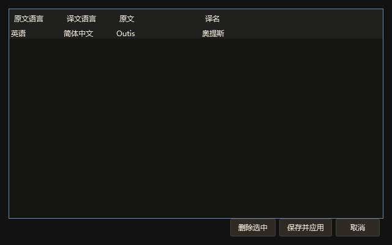
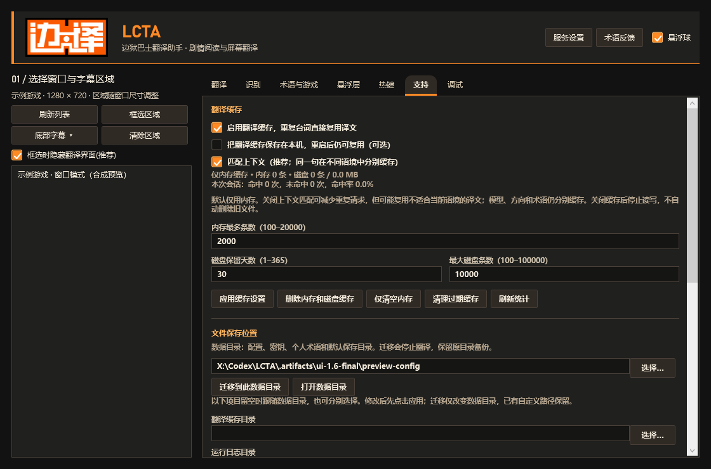

# 使用说明

[返回项目首页](../README.md)

## LCTA 1.6.0 的操作变化

本节对应 LCTA 1.6.0。默认沿用旧配置目录，也可迁移到自行选择的位置。

- 主界面左上显示“边·译”字标，右上可打开服务设置和术语反馈。首页显示当前档案、语言方向及服务状态。
- 首页可直接选择“自动 → 中”“英 → 中”“日 → 中”“韩 → 中”，其余方向从“切换方向”选择。不同进程／窗口类分别保存选区、档案与方向；选择新目标时停止原会话，新目标没有选区则需重新框选。
- 浏览器中即使打开边狱巴士介绍，也不会自动启用游戏档案；手动选择档案优先于自动匹配。切换目标后恢复该目标自己的选择。
- “识别”中的字幕稳定等待默认 450 毫秒，逐字字幕会等文字稳定后再请求；静态文章可改为 0 并保存。
- 同一句失败最多自动尝试 3 次。“重新尝试”会清理上下文并重新识别，可能产生新的调用；已有有效缓存仍会复用。服务改动需先保存。
- 提示词只携带原文匹配到的术语。禁用或待核对条目不参与翻译；核实后修改状态并启用。内置档案可另存为副本，不覆盖个人修改。
- 上下文最多 8 句、总计 4000 字符，切目标、方向、档案或识别区域失效时清理。OCR 在本机运行；联网服务会收到当前原文、匹配术语、档案提示及近期上下文。

## 悬浮球与底部字幕

主界面右上可开启或关闭悬浮球。入口显示透明底“边·译”图标，没有黑边与表面 `×`。单击展开主要功能，按住拖动可改变位置；菜单中的“关闭悬浮球”只关闭该入口，主程序不会退出。需要恢复时重新勾选主界面的“悬浮球”。图标上的橙色圆点表示发现程序或公共词库更新，在菜单中打开“程序 / 词库更新”查看。

点击“底部字幕”后选择手动框选，拖出实际对话文字范围，`Enter` 确认、`Esc` 取消。区域按客户区坐标保存，后续翻译持续使用；重启和重新选择相同目标会恢复。游戏改变对话框布局时重新框选，单纯移动窗口无需重选。

自动底部预设适合尚未框选的目标。已有手动区域时会提示先清除，避免点击预设后失去自己的范围。

## 个人术语立即应用

1. 先选择实际原文与译文语言。自动模式下添加术语前，切换到对应的“英 → 中”“日 → 中”“韩 → 中”或其他明确方向。
2. 在“术语与游戏 → 即时术语”填写原文和译名，例如 `Outis` → `奥提斯`。
3. 需要纠正已有错误时，填写旧译名，例如 `奥蒂斯`。多个写法用逗号分隔。
4. 点击“添加并立即应用”。当前句会重新识别，之后请求使用新词表；不必重启程序。

个人术语按方向保存，优先于档案；切换到不同方向不混用译名。AI 接口会收到匹配术语，普通接口只做本机译后校正；普通接口的旧译名未知时，程序无法凭空确定应该替换哪个词，请补充旧译名。

“管理个人术语”支持编辑和删除，点击“保存并应用”后生效，取消不改动已有内容。修改原有译名时，旧译名也会加入校正规则。



## 程序与公共词库更新

“支持”页显示程序和词库版本。可以手动检查，也可启用启动检查（每天最多一次）。发现更新时，主界面的“有更新”按钮与悬浮球圆点会保留提醒。

- **词库：** 点击“更新公共词库”，或开启自动应用。校验版本、ID 与 SHA256 后合并，保留个人术语和原档案的自行修改、禁用、删除。删除整个档案也不会被重新添加。
- **程序：** 点击“下载并安装新版”，选择安装包保存位置；SHA256 核对通过后启动安装器，旧程序停止并退出。安装时选择原登记目录，完成后重新打开。
- **安装包内的词库：** 新包包含发布时的公共版本，启动时按相同保留规则更新已有档案。
- **失败：** 网络、校验或保存失败时保留现有内容，可稍后重试。词库更新无需等待程序发版。

更新检查只读取维护者公开 GitHub 仓库，不发送台词、截图、个人词表或密钥。可关闭启动检查。原仓库的公共词库与维护步骤见 [terminology](../terminology/README.md)。
## 翻译其他游戏的底部字幕

目前仅内置《边狱巴士》术语档案。其他游戏可先使用通用翻译：

1. 将游戏设为窗口模式或无边框窗口，在翻译器中选择对应窗口。
2. 在“术语与游戏”选择“不使用 —— 通用翻译”，设置与字幕一致的翻译方向。开启自动匹配时，没有匹配档案的窗口会使用通用翻译。
3. 使用“底部字幕 → 手动框选底部对话框”，或点击“框选区域”选中字幕；尽量避开按钮、头像和其他文字。
4. 点击“开始翻译”，根据字幕位置调整悬浮层。字幕位置变化后重新框选。

游戏术语表是可选的。没有术语表也能翻译，但角色名、地名等可能与官方译名不同；需要统一译名时，可在“术语与游戏”中新建该游戏的档案并添加术语。

## 识别设置

在“识别”中选择引擎：

| 引擎 | 配置要求 |
|---|---|
| RapidOCR | 默认引擎，附带中、日、英通用模型和韩语专用模型，无需系统 OCR 语言功能。 |
| Windows OCR | 安装对应语言的“光学字符识别”功能，并选择与画面一致的语言。 |

RapidOCR 的 `auto` 比较通用和韩语模型，指定实际语言通常更快；无需系统语言功能。Windows OCR 的 `auto` 会尝试可用语言，耗时通常高于指定一种语言。未安装韩语系统 OCR 时不会默默用英语代替，请改用 RapidOCR 或安装语言功能。日语选 `ja`，英语选 `en-US`，简体中文选 `zh-Hans-CN`，韩语选 `ko-KR`。

文字较小时，可将识别前放大倍数设为 2–3。对比度增强用于文字与背景接近的画面，正常画面保持 0。RapidOCR 检测尺寸越大通常越慢，先用默认值再调整。

在“识别与翻译 → 画面捕获方式”选择后端，修改后点击“保存”：

| 方式 | 适用情况 |
|---|---|
| 窗口捕获（默认） | 使用 Windows Graphics Capture 读取目标窗口的合成画面；翻译框或其他窗口盖住选区时仍能读取原文，也不会读到悬浮译文。 |
| 屏幕捕获 | 读取当前可见屏幕。兼容窗口捕获不可用的程序，但需保持选区无遮挡，并把翻译框移出选区。 |
| PrintWindow | 传统窗口的替代后端，效果取决于目标程序。 |

首次升级到 1.3.2 时，旧版默认的屏幕捕获设置会迁移为窗口捕获；此后保留手动选择。窗口捕获不适用于最小化、受保护或停止绘制的画面；系统可能显示捕获边框。窗口捕获不支持或超时会尝试 PrintWindow；仍不可读时保留错误提示。手动切换屏幕捕获后必须保持选区无遮挡。

## 翻译服务

### OpenAI 兼容接口

选择 `openai-compatible`，填写服务商提供的地址、模型和 API Key。首次设置提供以下预设，也可手动修改：

| 服务 | 接口地址 | 示例模型 |
|---|---|---|
| DeepSeek | `https://api.deepseek.com` | `deepseek-flash` |
| 智谱 GLM | `https://open.bigmodel.cn/api/paas/v4` | `glm-4-flash` |
| 硅基流动 | `https://api.siliconflow.cn/v1` | `Qwen/Qwen2.5-7B-Instruct` |
| 通义千问／百炼 | `https://dashscope.aliyuncs.com/compatible-mode/v1` | `qwen-plus` |
| Google Gemini | `https://generativelanguage.googleapis.com/v1beta/openai` | `gemini-3.8-flash` |
| 本地 Ollama | `http://127.0.0.1:11434/v1` | 已下载的本机模型名 |
| 本地 Sakura | 本机 Sakura 兼容服务地址 | 已启动的日译中模型名 |
| 本地 LM Studio | `http://127.0.0.1:1234/v1` | 读取实际加载的模型 |
| 自定义兼容接口 | 服务商提供的兼容根地址 | 账户可用的文本聊天模型 |

预设是填写示例，模型可用性以账户权限和服务商当前列表为准。修改服务地址时清除旧密钥，避免误用其他服务的 Key。

1. 选择服务预设，或填写兼容根地址；地址可以包含 `/v1` 等服务商要求的路径。
2. 填写该服务的 API Key。本地服务没有启用鉴权时可以留空。
3. 点击“读取可用模型”，选择支持文本聊天的模型；不提供模型列表的服务可从控制台复制模型名。列表也可能包含图像或嵌入模型，不适合翻译。
4. 点击“测试连接”。这一步会发送示例文本，可能计入用量；读取列表只请求模型目录，不发送台词。
5. 主界面点击“应用服务设置”；首次设置点击保存。

百炼预设为北京区域示例，请优先使用控制台给出的业务空间完整地址，Key 与地址所属区域必须一致。Gemini 需要当前网络能够访问其 API。LM Studio 需先加载模型并启动 Developer 页的服务。原生 Claude 等不同协议需要兼容网关，直接填写原生地址无法使用。

接口形式参考 [百炼兼容接口](https://www.alibabacloud.com/help/en/model-studio/compatibility-of-openai-with-dashscope)、[Gemini 兼容接口](https://ai.google.dev/gemini-api/docs/openai)、[LM Studio 兼容接口](https://lmstudio.ai/docs/developer/openai-compat)。服务商调整地址、模型或权限后，以其官方说明为准。

DeepSeek 参数参考 [官方文档](https://api-docs.deepseek.com/)，硅基流动参数参考 [官方接口文档](https://docs.siliconflow.cn/docs/api/chat-completions-post)。程序按官方服务地址选择思考参数；自定义兼容地址使用通用请求字段。

上下文默认 3 句，表示请求携带此前原文和译文；设为 0 时逐句翻译。减少上下文和术语数量可减少请求量，实际速度取决于服务、模型与网络。

### 彩云、有道和百度

选择服务后填写相应凭据：

| 服务 | 凭据 |
|---|---|
| 彩云小译 | token，填写在密钥栏。 |
| 有道 | 应用 ID（appKey）和应用密钥（appSecret）。 |
| 百度 | 应用 ID（appid）和密钥。 |

传统接口不接收作品设定、风格或对话上下文，不支持 AI 术语生成；本机译后术语校正仍可使用。

彩云目前开放中文与英／日／韩之间的方向，英、日、韩之间的直接互译未开放；程序会在请求前提示更换服务。范围依据 [彩云官方支持表](https://docs-preview.caiyunapp.com/lingocloud-api/index.html#支持的语言)。其他服务与模型的可用语言以其官方接口和账户权限为准。

### 本地翻译

安装并启动 [Ollama](https://ollama.com/download)，下载模型，例如：

```powershell
ollama pull qwen2.5:7b-instruct
```

填入本机地址和模型名，默认不需要 API Key。首次调用可能需要加载模型，必要时增加超时。LM Studio 或 llama.cpp 等服务也可使用各自的兼容地址。

Sakura-GalTransl 主要用于日译中，选择 `sakura` 指令格式；通用聊天模型选择 `galgame`。模型许可由各自项目规定。

## 游戏档案与术语

“术语与游戏”可新建、编辑、导入和导出档案，保存名称、窗口关键字、语言、作品设定、风格和术语。自动匹配根据窗口标题选择档案，也可手动指定。

开启自动匹配后，切换到没有匹配档案的窗口会回到通用翻译。希望固定使用手动选定的档案时，取消自动匹配。翻译报纸、网页等普通内容可直接选择“不使用 —— 通用翻译”。

新配置默认“自动识别 → 中文”。框选不会判断内容属于哪款游戏，也不会自动更改已有的翻译方向。识别语言与翻译方向分别设置；悬浮栏选择“英 → 中”等预设时会同时更新两者。

内置《边狱巴士》档案以零协会汉化为参考，包含英文和日文术语。使用前请核对游戏版本和译名。

发现缺少的术语或错误译名，可填写 [术语补充／纠错表单](https://github.com/wl8695573-blip/GuGuGaGaTranslator/issues/new?template=terminology.yml)，提供原文、建议译名和出处，由维护者核对后整理。提交步骤见 [术语贡献说明](../CONTRIBUTING.md)。修改本机术语不会自动提交到 GitHub。LCTA 1.5.0 可在“支持”页检查并应用维护者发布的公共词库；自动应用需自行开启。

```text
en: Outis = 奥提斯 | 禁止: 奥德修斯、奥蒂斯
ja: ウーティス = 奥提斯 | 禁止: 奥德修斯、奥蒂斯
en: League of Nine = 九人会 | 禁止: 九人联盟
ja: 九人会 = 九人会
```

`en:`、`ja:`、`zh:` 标记原文语言。不标记时兼容旧格式，作为外语到中文的术语。译成中文时取源语言条目，中文译成外语时反向使用，日英互译时通过中文译名配对。“禁止”填写目标语言中的错误译法；同一语言的同一原文只保留一个条目。

AI 引擎将术语和作品设定加入请求，随后可进行本机替换校正。生成术语表时可提供简介或参考资料，结果需要人工核对，不能直接视为官方译名。

导入先进入编辑器，保存后生成独立副本；取消不会覆盖现有档案。格式与限制见 [档案分享](PROFILES.md)。

## 悬浮层与快捷键

| 设置 | 含义 |
|---|---|
| 位置 | 遮盖原文、区域下方或区域上方。 |
| 宽度、高度 | 0 表示自动计算，非零为固定尺寸。 |
| 最大行数 | 0 表示不限制。 |
| 编辑模式 | 允许拖动翻译框、拖四角缩放及滚动长译文，关闭后翻译框恢复鼠标穿透。 |
| 显示原文 | 在译文上方显示识别结果。 |
| 排除截图和录屏 | 请求 Windows 将悬浮层排除在捕获结果之外，效果取决于捕获软件。 |

控制条左端的拖动柄始终可用，拖动后控制条和翻译框一起移动，不必先关闭鼠标穿透。右端 `×` 会关闭两者并停止翻译，主界面的“停止”也会同时隐藏两者；再次点击“开始翻译”可重新显示。悬浮层会限制在当前屏幕的工作区内，长译文在编辑模式下使用鼠标滚轮查看。


录制带译文的画面时，关闭“翻译框不被录屏/截图拍到”。窗口捕获仍读取目标窗口本身，不会识别悬浮译文。屏幕捕获模式下仍需把翻译框移出识别区域。

| 默认组合键 | 功能 |
|---|---|
| `Ctrl+Alt+T` | 开始或停止翻译。 |
| `Ctrl+Alt+S` | 框选并开始；未选择目标时使用前台窗口。 |
| `Ctrl+Alt+R` | 重新框选。 |
| `Ctrl+Alt+P` | 暂停或继续。 |
| `Ctrl+Alt+U` | 开启或关闭编辑模式。 |
| `Ctrl+Alt+O` | 显示或隐藏原文。 |
| `Ctrl+Alt+H` | 显示或隐藏翻译框。 |

在“热键”中点击输入框并按组合键修改。`Backspace` 清除，`Esc` 取消录入。被占用时显示注册失败的项目。

## 缓存、配置与保存位置

### 数据目录与独立文件目录

默认读取 `%APPDATA%\GuGuGaGaTranslator`，无需手动搬迁旧设置。希望放到 X 盘时：

1. 打开“支持 → 文件保存位置”，在数据目录填入如 `X:\LCTA-data` 的完整路径，或点击选择目录。
2. 使用空目录。新旧目录不能互相包含，迁移不经过符号链接或目录联接。
3. 点击“迁移到此数据目录”。翻译停止，复制完成后立即使用新目录，下次启动也使用它；原目录保留为备份。
4. 已单独设置的外部目录保持原位置。要同时改这些位置，先点击“应用文件位置”，再迁移数据目录。

迁移中关闭主窗口会取消复制并继续使用原目录。失败或取消时新目录可能有部分副本，重新操作请选择另一个空目录。确认新目录正常后，原备份的清理由用户决定。

| 文件 | 默认位置 | 修改入口 |
|---|---|---|
| 设置、加密密钥、个人术语、目标选区与档案 | 数据目录中的配置文件及备份 | 支持 → 数据目录迁移 |
| 磁盘翻译缓存 | 数据目录下 `cache` | 支持 → 缓存目录 |
| 无正文运行日志 | 数据目录下 `logs` | 支持 → 日志目录 |
| 调试截图与证据 | 数据目录下 `dumps` | 调试 → 证据目录 |
| 档案和诊断包导出 | 数据目录下 `exports` | 支持 → 导出目录；保存对话框也可改位置 |
| 新版安装包下载 | 数据目录下 `updates` | 支持 → 更新下载目录；下载时也可改位置 |
| 离线 OCR 模型 | 程序目录下 `models` | 识别 → 模型目录 |
| 应用、运行库与随包公共词库 | 安装或解压目录 | 安装时选择，便携版完整解压到指定位置 |

独立目录留空时跟随数据目录，填写时使用完整路径。修改缓存位置时，目标没有数据库则迁移原缓存；目标已有数据库则使用目标缓存，原文件保留。改变日志、证据、导出和下载目录只影响后续保存，外部旧文件不会自动搬迁。

修改 OCR 模型位置时，复制整个 `models` 文件夹，选择其中的 `v6`，保留同级 `korean` 文件夹。修改后保存。便携版的 DLL 也必须留在程序旁，不能只移动 EXE。Windows 自身和安装器运行时的临时文件仍由系统管理。

目录定位只在当前用户注册表中保存一个路径。密钥与磁盘缓存使用当前 Windows 账户 DPAPI 加密，同一账户迁移目录可继续读取；换电脑或账户后需重新填写密钥。不要公开分享配置与数据库。

### 缓存怎样设置

缓存用于复用已经成功翻译的内容，减少重复请求。默认开启内存缓存，退出后清空；磁盘缓存需自行开启。

| 设置 | 用途与建议 |
|---|---|
| 启用缓存 | 关闭后不再读写任何翻译缓存，已有磁盘文件保留。 |
| 启用磁盘缓存 | 重启后继续复用；译文加密，只保存请求哈希、译文和时间戳。 |
| 内存容量 | 默认 2000 条，可设 100–20000 条；达到容量淘汰较久未使用的记录。 |
| 保留天数 | 默认 30 天，可设 1–365 天；内存与磁盘均检查过期，读入内存不延长旧记录寿命。 |
| 磁盘容量 | 默认 10000 条，可设 100–100000 条，写入时清理超量旧记录。 |
| 区分上下文 | 默认开启，适合剧情。关闭后相同原文可跨上下文复用，省请求，但可能复用不符合当前语境的译文。 |

更换接口、模型、语言方向、术语、设定或风格时仍会隔离缓存。添加新术语不会使用修改前的旧结果。

- **仅清空内存：** 磁盘仍保留，之后可能重新从磁盘命中。
- **清空全部：** 取消旧请求，清空内存和当前磁盘缓存；之后重新翻译。
- **清理过期记录：** 保留仍有效的记录，同时整理容量。
- **刷新统计：** 查看当前内存、磁盘条数与大小，以及本次运行的命中／未命中和命中率。

点击“应用缓存设置”保存。磁盘故障时回退内存并提示，不影响已有配置。命中率是缓存查询统计，不等于账单节省比例。

### 诊断与隐私

诊断 ZIP 包含版本、白名单设置、状态、计数和耗时，不含密钥、地址、窗口标题、截图、台词、译文、提示词或档案，不自动上传。调试抓屏不在 ZIP 中，分享前应单独检查。



## 问题排查

1. **没有原文：** 检查窗口与选区是否正确、可见且未最小化；Windows OCR 还需检查语言功能。
2. **识别到按钮：** 缩小选区。语言过滤不能识别所有按钮，英文按钮仍可能被当作英文台词。
3. **有原文没有译文：** 确认未使用预览模式；测试连接，检查模型、权限、额度与超时。
4. **译文滞后：** 调整选区和 OCR 尺寸，检查网络，减少上下文和不必要的术语。
5. **选区偏移：** 改变布局、分辨率或显示器后重新框选。
6. **无法启动或下载被拦截：** 确认 Windows x64 系统和文件完整性，核对 SHA256，保留系统提示内容。

仍无法解决时，在 [Issues](https://github.com/wl8695573-blip/GuGuGaGaTranslator/issues/new/choose) 填写应用和 Windows 版本、窗口模式、缩放、引擎及复现步骤，可附诊断 ZIP。截图遮盖私人内容，不要附密钥、配置、缓存数据库或完整抓屏目录。
